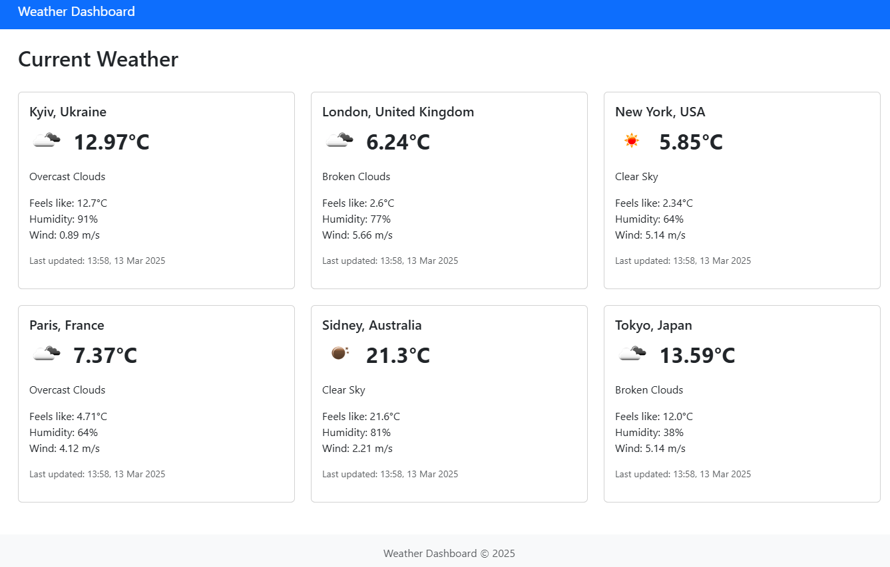

# 🌦️ Weather Dashboard

Real-time Weather Monitoring System - RESTful API service for tracking weather conditions in cities worldwide.



## 📋 Table of Contents
- [Overview](#-overview)
- [Features](#-features)
- [Tech Stack](#-tech-stack)
- [System Requirements](#-system-requirements)
- [Installation](#-installation)
  - [Local Setup](#local-setup)
  - [Docker Setup](#docker-setup)
- [Environment Variables](#-environment-variables)
- [API Documentation](#-api-documentation)
- [Database Structure](#-database-structure)
- [Testing](#-testing)
- [API Examples](#-api-examples)
- [Architecture & Design Decisions](#-architecture-design-decisions)

## 🌐 Overview

Weather Dashboard is a comprehensive weather monitoring system that provides real-time weather data for cities worldwide. The system allows users to track current weather conditions, historical weather data, and manage city information efficiently.

## ✨ Features

### City Management
- Create and manage cities with location information
- Search cities by name or country
- Automatic weather updates for registered cities

### Weather Data
- Real-time weather information including:
  - Temperature and feels-like temperature
  - Humidity and pressure
  - Wind speed and direction
  - Weather conditions and descriptions
- Historical weather data tracking
- Automatic hourly weather updates via Celery tasks

### API Features
- JWT Authentication
- Filtering capabilities for weather data
- Swagger/ReDoc API documentation
- Role-based access control
- Comprehensive test coverage

## 🛠 Tech Stack

- **Python 3.12**
- **Django 5.1**
- **Django REST Framework**
- **PostgreSQL**
- **Redis**
- **Celery**
- **Docker & Docker Compose**
- **Poetry (dependency management)**
- **JWT Authentication**
- **OpenWeatherMap API**
- **Swagger/ReDoc Documentation**

## 🏗 Architecture & Design Decisions

### Project Structure
- **Core App**: Contains project-wide settings and configurations
- **Weather App**: Main application module with all weather-related functionality

### Key Design Decisions

1. **Service Layer Pattern**
   - Separation of business logic into `WeatherService`
   - Encapsulation of OpenWeatherMap API interaction
   - Easy to switch weather data providers if needed

2. **Task Queue Architecture**
   - Celery for handling asynchronous tasks
   - Scheduled weather updates using Celery Beat
   - Redis as message broker and result backend

3. **API Design**
   - RESTful architecture following Django REST Framework best practices
   - JWT authentication for secure API access
   - Role-based permissions (admin vs regular users)
   - Comprehensive filtering system for weather data

4. **Data Models**
   - City model with geographical coordinates
   - WeatherData model for historical weather tracking

5. **Testing Strategy**
   - Comprehensive test coverage
   - Separate test settings
   - Mock external API calls in tests

## 💻 System Requirements

- Python 3.12+
- PostgreSQL
- Redis
- Docker & Docker Compose (for containerized setup)

## 🚀 Installation

### Local Setup

1. Clone the repository:
   ```bash
   git clone https://github.com/vladyslav-tmf/weather-dashboard.git
   cd weather-dashboard
   ```

2. Create and activate virtual environment (skip this step if Poetry is installed):
    - Linux/Mac:
      ```bash
      python3 -m venv venv
      source venv/bin/activate
      ```
    - Windows:
      ```bash
      python -m venv venv
      venv\Scripts\activate
      ```

3. Install Poetry and dependencies:
   ```bash
   pip install poetry # if Poetry isn't installed yet
   poetry install
   ```

4. Create .env file:
   ```bash
   cp .env.example .env
   # Edit .env file with your configurations
   ```

5. Apply database migrations:
   ```bash
   python manage.py migrate
   ```

6. Create superuser:
   ```bash
   python manage.py createsuperuser
   ```

7. Run the development server:
   ```bash
   python manage.py runserver
   ```

The application will be available at:
- Dashboard: http://localhost:8000/
- API: http://localhost:8000/api/v1/
- Admin panel: http://localhost:8000/admin/
- API Documentation (swagger): http://localhost:8000/api/docs/swagger/
- API Documentation (redoc): http://localhost:8000/api/docs/redoc/

### Docker Setup

1. Clone the repository:
   ```bash
   git clone https://github.com/vladyslav-tmf/weather-dashboard.git
   cd weather-dashboard
   ```

2. Create .env file:
   ```bash
   cp .env.example .env
   # Edit .env file with your configurations
   ```

3. Build and run containers:
   ```bash
   docker-compose up --build
   ```

4. Create superuser in Docker:
   ```bash
   docker-compose exec app python manage.py createsuperuser
   ```

## 🔐 Environment Variables

Create a `.env` file in the root directory with the following variables:

```env
# Django settings
DEBUG=True
SECRET_KEY=your_secret_key
ALLOWED_HOSTS=localhost,127.0.0.1

# Database settings
POSTGRES_DB=postgres
POSTGRES_USER=postgres
POSTGRES_PASSWORD=postgres
POSTGRES_HOST=db
POSTGRES_PORT=5432

# Celery settings
CELERY_BROKER_URL=redis://redis:6379/0
CELERY_RESULT_BACKEND=redis://redis:6379/0

# OpenWeatherMap
OPEN_WEATHER_MAP_API_KEY=your_api_key
```

## 📚 API Documentation

The API documentation is available in:
- Swagger UI format at `/api/docs/swagger/`
- ReDoc format at `/api/docs/redoc/`

It provides detailed information about:
- Available endpoints
- Request/Response formats
- Authentication methods
- API parameters

## 🗄 Database Structure

The project includes the following main models:

### City
- name
- country
- latitude
- longitude
- external_id (for OpenWeatherMap API, optional)

### WeatherData
- city (Foreign Key to City)
- temperature
- feels_like
- humidity
- pressure
- wind_speed
- wind_direction
- weather_condition
- weather_description
- icon
- timestamp

## 🧪 Testing

The project includes comprehensive tests for:
- Models
- Views
- Serializers
- Admin panel functionality
- API endpoints

Run tests using:
```bash
# Local environment
python manage.py test

# Docker environment
docker-compose exec app python manage.py test
```

## 📝 API Examples

### Authentication
```bash
# Get JWT token
curl -X POST http://localhost:8000/api/v1/token/ \
    -H "Content-Type: application/json" \
    -d '{"username": "user@example.com", "password": "password"}'
```

### Cities
```bash
# Get list of cities with current weather
curl -X GET http://localhost:8000/api/v1/cities/with_current_weather/ \
    -H "Authorization: Bearer <your_token>"

# Update weather for a specific city (admin only)
curl -X POST http://localhost:8000/api/v1/cities/{city_id}/update_weather/ \
    -H "Authorization: Bearer <your_token>"
```

### Weather Data
```bash
# Get weather data with filters
curl -X GET "http://localhost:8000/api/v1/weather/?city_name=London&min_temperature=20" \
    -H "Authorization: Bearer <your_token>"

# Update weather for all cities (admin only)
curl -X POST http://localhost:8000/api/v1/weather/update_all/ \
    -H "Authorization: Bearer <your_token>"
```
